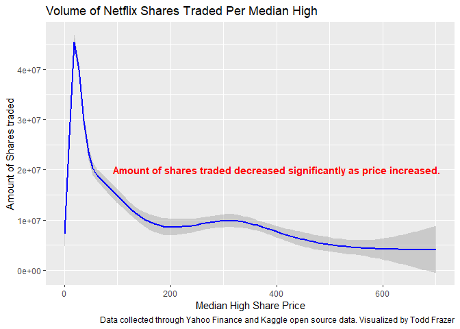

Netflix Analysis RMarkdown
================
Todd Frazer
`r Sys.Date()`


## Data Header of 20,000 data points from Netflix open source data from Kaggle and Yahoo Finance.

``` r
library(ggplot2)
Netflix_raw_data <- read.csv("Netflix-Analysis/Netflix_raw_data.csv”)
head(Netflix_raw_data)
```


<!-- -->
